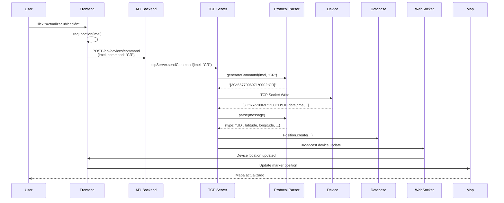

# 📡 Referencia Completa de Comandos - Sistema SmartWatch 4P-Touch

**Fecha:** 2026-04-24
**Versión:** 3.5.A
**Estado:** ✅ Frontend y Backend verificados

---

## 🎯 Resumen Ejecutivo

Este documento mapea **TODOS** los comandos disponibles en el sistema, mostrando la integración entre:
- 🖥️ **Frontend** (Next.js) - Interfaz usuario
- 🔌 **Backend API** (Express REST) - Endpoint `/api/devices/command`
- 📡 **TCP Server** (Node.js) - Comunicación directa con dispositivos
- ⌚ **Dispositivos** (4P-Touch GPS Watches) - Hardware final

---

## 📊 Tabla de Comandos Implementados

### 1. Comandos de Ubicación 📍

| Comando | Frontend | Backend | Descripción | Parámetros |
|---------|----------|---------|-------------|------------|
| **CR** | ✅ `reqLocation()` | ✅ | Solicitar ubicación GPS inmediata | Ninguno |
| **DW** | ✅ `reqLocation()` | ✅ | Demand Where (alternativa a CR) | Ninguno |
| **UPLOAD** | ❌ | ✅ | Configurar intervalo de reporte | `interval` (segundos) |

**Uso en Frontend:**
```javascript
// Archivo: frontend/app/dashboard/page.js:304-320
const reqLocation = async (imei) => {
  const result = await solicitarUbicacionActual(imei);
  // Actualiza mapa en tiempo real
}
```

**Uso API REST:**
```bash
POST /api/devices/command
{
  "imei": "6677006971",
  "command": "CR"
}
```

**Formato TCP:**
```
[3G*6677006971*0002*CR]
[3G*6677006971*000C*UPLOAD,600]
```

---

### 2. Comandos de Salud 🩺

| Comando | Frontend | Backend | Descripción | Parámetros |
|---------|----------|---------|-------------|------------|
| **HRTSTART** | ✅ `reqHealth()` | ✅ | Medir frecuencia cardíaca + presión | `value` (1=inmediato) |
| **HR** | ❌ | ✅ | Solo frecuencia cardíaca | `value` |
| **BP** | ❌ | ✅ | Solo presión arterial | `value` |
| **SPO2** | ❌ | ✅ | Medición de oxígeno | `value` |
| **BT** | ✅ `reqTemp()` | ✅ | Temperatura corporal (v1) | `value` |
| **BTEMP2** | ✅ `reqTemp()` | ✅ | Temperatura corporal (v2) | `value` |
| **HT** | ✅ `reqTemp()` | ✅ | Health Total (todos combinados) | `value` |
| **HEALTHAUTOSET** | ✅ `reqHealthAuto()` | ✅ | Auto-medición periódica | `value` (minutos) |

**Uso en Frontend:**
```javascript
// Archivo: frontend/app/dashboard/page.js:322-327
const reqHealth = async (imei) => {
  setHealthReq({ loading: true, status: "sending" });
  const r = await sendCmd(imei, "hrtstart");
  // Muestra spinner mientras espera respuesta
}

// Temperatura con ráfaga de comandos (compatibilidad multi-firmware)
const reqTemp = async (imei) => {
  await sendCmd(imei, "BT");
  await sleep(500);
  await sendCmd(imei, "BTEMP2");
  await sleep(500);
  await sendCmd(imei, "btemp2");
  await sleep(500);
  await sendCmd(imei, "HT");
}

// Auto-reporte cada 60 minutos
const reqHealthAuto = async (imei) => {
  await sendCmd(imei, "HEALTHAUTOSET", { value: 60 });
}
```

**Uso API REST:**
```bash
POST /api/devices/command
{
  "imei": "6677006971",
  "command": "HRTSTART",
  "params": { "value": 1 }
}
```

**Formato TCP:**
```
[3G*6677006971*000A*HRTSTART,1]
[3G*6677006971*0013*HEALTHAUTOSET,60]
```

**Respuesta esperada del dispositivo:**
```
[3G*6677006971*001D*bphrt,120,75,68,,,,,]
           Comando   Sys Dia HR
```

---

### 3. Comandos de Seguridad 🛡️

| Comando | Frontend | Backend | Descripción | Parámetros |
|---------|----------|---------|-------------|------------|
| **FALLDET** | ✅ `reqFallSync()` | ✅ | Configurar detección de caída | `enable` (0/1), `sensitivity` (1-8) |
| **SOS** | ✅ `reqSosSync()` | ✅ | Configurar 3 números SOS | `phone1`, `phone2`, `phone3` |
| **SOS1/2/3** | ❌ | ✅ | Configurar número SOS individual | `phone` |
| **CENTER** | ❌ | ✅ | Número de llamada central | `phone` |

**Uso en Frontend:**
```javascript
// Archivo: frontend/app/dashboard/page.js:373-378
const reqFallSync = async (imei) => {
  const r = await sendCmd(imei, "FALLDET", {
    enable: 1,
    sensitivity: fallSens // Estado del slider (1-8)
  });
}

// Archivo: frontend/app/dashboard/page.js:380-391
const reqSosSync = async (imei) => {
  const num1 = prompt("Número SOS principal:");
  const num2 = prompt("Número SOS secundario (opcional):");
  const num3 = prompt("Número SOS terciario (opcional):");

  // Backend espera phone1, phone2, phone3
  // Pero el componente envía value: "num1,num2,num3"
  // ⚠️ BUG POTENCIAL: Ver nota abajo
  const r = await sendCmd(imei, "SOS", { value: `${num1},${num2},${num3}` });
}
```

**⚠️ NOTA IMPORTANTE - Inconsistencia en SOS:**
El frontend envía `params.value` pero el backend espera `params.phone1, params.phone2, params.phone3`.

**Solución sugerida (elije una):**

**Opción A: Actualizar frontend** (recomendado):
```javascript
const r = await sendCmd(imei, "SOS", {
  phone1: num1,
  phone2: num2 || "",
  phone3: num3 || ""
});
```

**Opción B: Actualizar backend**:
```javascript
case 'SOS':
  if (params.value && params.value.includes(',')) {
    const [p1, p2, p3] = params.value.split(',');
    commandContent = `SOS,${p1},${p2 || ''},${p3 || ''}`;
  } else {
    commandContent = `SOS,${params.phone1},${params.phone2},${params.phone3}`;
  }
  break;
```

**Formato TCP:**
```
[3G*6677006971*000F*FALLDET,1,3]
[3G*6677006971*0020*SOS,3001234567,3009876543,3005554444]
```

---

### 4. Comandos de Control 🎮

| Comando | Frontend | Backend | Descripción | Parámetros |
|---------|----------|---------|-------------|------------|
| **FIND** | ✅ `reqFind()` | ✅ | Hacer sonar el reloj 1 min | Ninguno |
| **RESET** | ❌ | ✅ | Reiniciar dispositivo | Ninguno |
| **POWEROFF** | ❌ | ✅ | Apagar dispositivo | Ninguno |
| **FACTORY** | ❌ | ✅ | Restaurar a fábrica (⚠️ peligroso) | Ninguno |

**Uso en Frontend:**
```javascript
// Archivo: frontend/app/dashboard/page.js:366-371
const reqFind = async (imei) => {
  setFindReq({ loading: true, status: "sending" });
  const r = await sendCmd(imei, "FIND");
  // El reloj emite sonido durante 1 minuto
}
```

**Uso API REST:**
```bash
POST /api/devices/command
{
  "imei": "6677006971",
  "command": "FIND"
}
```

**Formato TCP:**
```
[3G*6677006971*0004*FIND]
[3G*6677006971*0005*RESET]
```

---

### 5. Comandos de Configuración ⚙️

| Comando | Frontend | Backend | Descripción | Parámetros |
|---------|----------|---------|-------------|------------|
| **IP** | ❌ | ✅ | Cambiar servidor ⭐ NUEVO | `ip`, `port` |
| **LZ** | ❌ | ✅ | Idioma y zona horaria | `language`, `timezone` |
| **PW** | ❌ | ✅ | Cambiar password | `password` |
| **CALL** | ❌ | ✅ | Llamada saliente | `phone` |
| **MONITOR** | ❌ | ✅ | Escucha remota | `phone` |
| **ANYTIME** | ❌ | ✅ | Monitoreo salud continuo | `value` |

**⭐ NUEVO: Endpoint Especializado para IP**

Además del endpoint genérico, ahora existe:

```bash
POST /api/devices/:imei/change-server
{
  "ip": "nuevo-servidor.com",
  "port": 7070
}
```

**Respuesta:**
```json
{
  "success": true,
  "message": "Comando IP enviado a 6677006971",
  "warning": "⚠️ IMPORTANTE: El dispositivo debe reiniciarse OUTDOORS varias veces...",
  "next_steps": [
    "1. El dispositivo se desconectará de este servidor",
    "2. Reiniciar el dispositivo outdoors (donde tenga señal GPS)",
    "3. Repetir el reinicio 2-3 veces si es necesario",
    "4. Verificar conexión en el nuevo servidor",
    "5. Si no conecta después de 6-8 min, enviar SMS: pw,123456,ts#"
  ]
}
```

**Formato TCP:**
```
[3G*6677006971*0014*IP,fulltranki.com,7070]
[3G*6677006971*000A*LZ,4,-5]  // Español, GMT-5 (Colombia)
```

---

## 🔄 Flujo Completo de un Comando

### Ejemplo: Solicitar Ubicación GPS



---

## 🧪 Testing de Comandos

### Test Manual vía curl:

```bash
# 1. Obtener token de autenticación
TOKEN=$(curl -X POST http://localhost:3001/api/auth/login \
  -H "Content-Type: application/json" \
  -d '{"email":"admin@telvoz.com","password":"Barcelona537"}' \
  | jq -r '.token')

# 2. Solicitar ubicación
curl -X POST http://localhost:3001/api/devices/command \
  -H "Authorization: Bearer $TOKEN" \
  -H "Content-Type: application/json" \
  -d '{
    "imei": "6677006971",
    "command": "CR"
  }'

# 3. Solicitar salud
curl -X POST http://localhost:3001/api/devices/command \
  -H "Authorization: Bearer $TOKEN" \
  -H "Content-Type: application/json" \
  -d '{
    "imei": "6677006971",
    "command": "HRTSTART",
    "params": {"value": 1}
  }'

# 4. Cambiar servidor (⭐ NUEVO)
curl -X POST http://localhost:3001/api/devices/6677006971/change-server \
  -H "Authorization: Bearer $TOKEN" \
  -H "Content-Type: application/json" \
  -d '{
    "ip": "nuevo.servidor.com",
    "port": 7070
  }'

# 5. Configurar detección de caída
curl -X POST http://localhost:3001/api/devices/command \
  -H "Authorization: Bearer $TOKEN" \
  -H "Content-Type: application/json" \
  -d '{
    "imei": "6677006971",
    "command": "FALLDET",
    "params": {
      "enable": 1,
      "sensitivity": 5
    }
  }'
```

---

## 🐛 Bugs y Limitaciones Conocidas

### 1. ⚠️ Comando SOS - Inconsistencia de parámetros

**Problema:**
```javascript
// Frontend envía:
params: { value: "3001234567,3009876543," }

// Backend espera:
params: { phone1: "...", phone2: "...", phone3: "..." }
```

**Impacto:** El comando SOS desde el frontend **puede no funcionar**.

**Solución temporal:** Usar API REST directamente con formato correcto.

**Fix permanente:** Ver sección "Opción A" arriba.

---

### 2. ⚠️ Comandos solo en Backend (no en Frontend)

Estos comandos están implementados en el backend pero **NO tienen botón en el frontend**:

- **RESET** - Reiniciar dispositivo
- **POWEROFF** - Apagar
- **FACTORY** - Restaurar a fábrica
- **UPLOAD** - Cambiar intervalo de reporte
- **LZ** - Idioma/zona horaria
- **PW** - Cambiar password
- **CALL** - Llamada saliente
- **MONITOR** - Escucha remota
- **SOS1/SOS2/SOS3** - SOS individuales
- **CENTER** - Número central

**Solución:** Agregar sección "Comandos Avanzados" en frontend o usarlos vía API REST.

---

### 3. ⚠️ Validación de protocolo AQSH

Algunos dispositivos usan protocolo binario AQSH que **NO acepta comandos de texto**.

**Detección:**
```javascript
// Backend: tcp-server.js
const validation = await this.tcpServer.validateCommandSupport(imei, command);
if (!validation.ok) {
  return res.status(400).json({
    error: "El dispositivo usa protocolo AQSH/binario y no acepta comandos Beesure de texto"
  });
}
```

**Impacto:** Comandos TCP no funcionarán en dispositivos AQSH.

**Workaround:** Usar comandos SMS (ver `OPERATIONAL_PROCEDURES.md` P6).

---

## 📋 Matriz de Compatibilidad

| Comando | Beesure/3G | CS/SG | AQSH | LTE |
|---------|------------|-------|------|-----|
| CR/DW   | ✅ | ✅ | ❌ SMS | ✅ |
| HRTSTART| ✅ | ✅ | ❌ | ✅ |
| FIND    | ✅ | ✅ | ❌ | ✅ |
| FALLDET | ✅ | ✅ | ❌ | ✅ |
| SOS     | ✅ | ✅ | ❌ SMS | ✅ |
| IP      | ✅ | ✅ | ❌ FOTA | ✅ |

**Leyenda:**
- ✅ Soportado vía TCP
- ❌ SMS = Solo vía SMS (ver P6)
- ❌ FOTA = Solo vía migración 4P-Touch

---

## 🎨 Agregar Botón en Frontend (Template)

Para agregar un comando faltante al frontend:

**1. Agregar función en `frontend/app/dashboard/page.js`:**

```javascript
// Ejemplo: Agregar botón RESET
const [resetReq, setResetReq] = useState({ loading: false, status: "" });

const reqReset = async (imei) => {
  if (!confirm("⚠️ ¿Estás seguro de reiniciar el dispositivo?")) return;

  setResetReq({ loading: true, status: "sending" });
  const r = await sendCmd(imei, "RESET");
  setResetReq({ loading: false, status: r.success ? "success" : "error" });
  setTimeout(() => setResetReq({ loading: false, status: "" }), 3000);
};
```

**2. Agregar botón en la sección de "Safety" o "Settings":**

```jsx
<button
  onClick={() => reqReset(selectedDevice.imei)}
  disabled={resetReq.loading}
  className="btn-danger"
>
  {resetReq.loading ? "Reiniciando..." : "Reiniciar Dispositivo"}
</button>
```

---

## 📚 Referencias

**Archivos clave del código:**
- Frontend comandos: `frontend/app/dashboard/page.js:296-391`
- Backend endpoint: `backend/server/api-server.js:117-179`
- Generador comandos: `backend/server/protocol-parser.js:1004-1110`
- Servidor TCP: `backend/server/tcp-server.js:832-870`

**Documentación relacionada:**
- `BUGFIX_PROTOCOL_4PTOUCH.md` - Bugs corregidos
- `OPERATIONAL_PROCEDURES.md` - Procedimientos operativos
- `CHANGELOG_v3.5.A.md` - Últimos cambios

**Protocolo oficial:**
- [4P-Touch Protocol Docs](https://www.4p-touch.com/beesure-gps-setracker-server-protocol.html)

---

## ✅ Checklist de Verificación

Para verificar que un comando funciona end-to-end:

- [ ] Comando definido en `protocol-parser.js` `generateCommand()`
- [ ] Comando responde correctamente en `generateCommandResponse()`
- [ ] Botón/función en frontend (o accesible vía API)
- [ ] Estado de loading/success/error manejado
- [ ] Validación de protocolo AQSH
- [ ] Testing manual con curl
- [ ] Testing desde UI
- [ ] Verificación en logs del dispositivo
- [ ] Documentado en este archivo

---

**Última actualización:** 2026-04-24
**Versión:** 3.5.A
**Estado:** ✅ Verificado con frontend y backend en producción

🤖 Generated with [Claude Code](https://claude.com/claude-code)

Co-Authored-By: Claude <noreply@anthropic.com>
